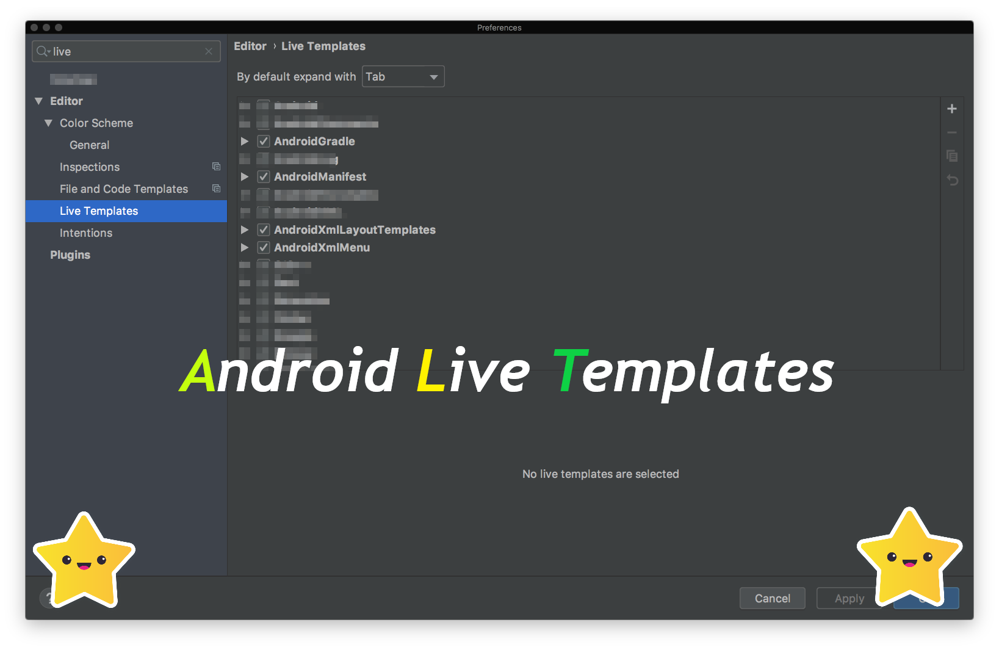

 
-------------------------------------------------------

# AndroidLiveTemplates

 :rocket: A curated android templates to make android development more easy and fast:battery:!
 
### :bulb: Goal 

The main idea behind this repo is to share basic android development template which helps developers to write less code.

### :hammer: How to use:

**Step 1:** First download latest AndroidLiveTemplates from [Live_templates_android.zip](https://github.com/pranaypatel512/AndroidLiveTemplates/blob/master/Live_templates_android.zip?raw=true)

**Step 2:** Open AndroidStudio and Choose menu **File** > and select **Import Settings...** from the menu.

**Step 3:** Specify live template configuration path by selection **Live_templates_android.zip** file.

**Step 4:** Now select the **Live templates** checkbox and click OK.
          
**Step 5:** After restarting AndroidStudio you will get the all templates at **Live Templates** by navigating
                  **File** > **Settings** > **Editor** > **Live Templates**

### :book: Example:

We have added templates in individual templates group like AndroidManifest, AndroidXmlLayoutTemplates, AndroidGradle, AndroidXmlMenu etc.

**1. AndroidXmlLayoutTemplates**

| Template Name   	| Purpose       	| Properties |
|-----------------	|---------------	|------------|
| center_parent    | Set view in the center of parent in the ConstraintLayout |app:layout_constraintStart_toStartOf="parent" app:layout_constraintEnd_toEndOf="parent" app:layout_constraintTop_toTopOf="parent" app:layout_constraintBottom_toBottomOf="parent"
| center_vertical  | Set vertical constraint on view | app:layout_constraintTop_toTopOf="@+id/VIEW_ID" app:layout_constraintBottom_toBottomOf="@+id/VIEW_ID"
| center_vertical_parent  | Set vertical constraint on view with parent | app:layout_constraintStart_toStartOf="parent" app:layout_constraintEnd_toEndOf="parent"
| center_horizontal  |  Set horizontal constraint on view | app:layout_constraintStart_toStartOf="@+id/VIEW_ID" app:layout_constraintEnd_toEndOf="@+id/VIEW_ID"
| center_horizontal_parent  | Set horizontal constraint on view with parent | app:layout_constraintStart_toStartOf="parent" app:layout_constraintEnd_toEndOf="parent"

For more templates checkout [WIKI](https://github.com/pranaypatel512/AndroidLiveTemplates/wiki#1-androidxmllayouttemplates)

**2. AndroidManifest**

| Template Name   	| Purpose       	| Properties |
|-----------------	|---------------	|------------|
| permission_storage | Add read/write permissioin for external storage  | < uses-permission android:name="android.permission.WRITE_EXTERNAL_STORAGE"/>                < uses-permission android:name="android.permission.READ_EXTERNAL_STORAGE"/>

For more templates checkout [WIKI](https://github.com/pranaypatel512/AndroidLiveTemplates/wiki#2-androidmanifest)

                  
### Screenshots
| Center in parent                                                                | 
| ------------------------------------------------------------------------------- | 
|   |
-----------------------------------------------------------------------------------
| Android menu setup                                                              |
| ------------------------------------------------------------------------------- |
|            |
-----------------------------------------------------------------------------------

### :heavy_plus_sign: Adding more templates!

**we are Welcoming PR!**

**Step 1:** Add new tempalte(s) in your android studio aftert importing latest [Live_templates_android.zip](https://github.com/pranaypatel512/AndroidLiveTemplates/blob/master/Live_templates_android.zip?raw=true)

**Step 2:** Export the setting with only "Live Templates" section.
         **File** -> **Exports Settings** -> Click on **Select None** to deselect other settings. -> Select **Live Templates(schemes)**


         
**Step 3:** Upload latest settings file with new brach and Send PR.

 Check out contribution guidelines [CONTRIBUTING.md](https://github.com/pranaypatel512/AndroidLiveTemplates/blob/master/CONTRIBUTING.md) 

### :movie_camera: Videos guide

* **Live template setup** : https://youtu.be/QDA4tWGsIIs
* **Live template usages** : https://youtu.be/35D7FyjGRxM

### Built With

* [Android Studio](https://developer.android.com/studio/index.html) - The Official IDE for Android

### :envelope: Get in touch!

* [@Twitter](https://twitter.com/pranatpatel_)

* https://about.me/pranaypatel

### Find this project useful ? ❤️

Support it by clicking the ⭐️ button on the upper right of this page. ✌️

### License

```
   Copyright © 2019 Pranay Patel

   Licensed under the Apache License, Version 2.0 (the "License");
   you may not use this file except in compliance with the License.
   You may obtain a copy of the License at

       http://www.apache.org/licenses/LICENSE-2.0

   Unless required by applicable law or agreed to in writing, software
   distributed under the License is distributed on an "AS IS" BASIS,
   WITHOUT WARRANTIES OR CONDITIONS OF ANY KIND, either express or implied.
   See the License for the specific language governing permissions and
   limitations under the License.
```
